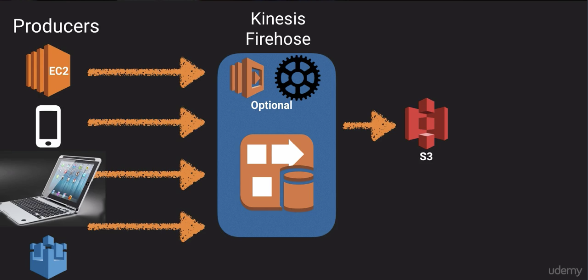
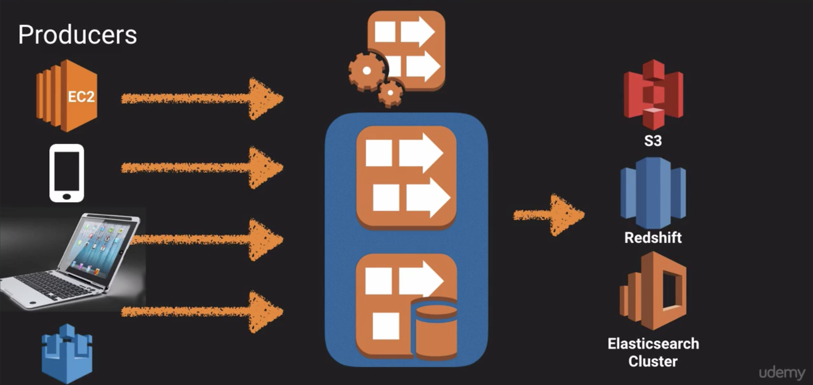

Simple Queue Service (SQS)
--------------------------

### Overview

* A web service providing a message queue used to store message while waiting for a computer to process them.
* A distributed queue system that enables web service applications to queue messages taht one component generates to be consumed by another component.
* A queue is a temporary repository for messages that are awaiting processing.

### Features

* Decouple the components of an application to run independenly
* Store messages in a fail-safe queue
* Messages can contain up to 256 KB of text in any format
* Components can later retrieve the messages programmatically using the Amazon SQS API
* Queue acts as a buffer between the component producing and saving data and the component receiving the data for processing.
* Resolves issues that arise if the the producer is producing work faster than the consumer can process it, or if the producer or consumer are only intermittently connected to the network.
* Can use Auto-scaling Groups to scale consumer EC2 instances to handle the work produced.

### Queue Types

* Standard Queues (default)
* FIFO Queues

#### Standard Queues

* This is the default queue type
* Provies neearly-unlimited number of transactions per second
* Guarantee that a messsage is delivered at least once
* Occasionally more than one copy of a message may be delivered out of order (due to hightly-distributed architecture)
* Provide best-effort ordering ensuring messages are generally delivered in the same order as they are sent

#### FIFO Queues

* Complements standard queues
* Provides first-in-first-out delivery and exactly-once processing
* The order of messages sent and received are strictly preserved
* A message is delivered once and remains available until a consumer processes and deletes it
* No duplicates are introduced to the queue
* Supports message groups that allow multiple ordered message groups within a single queue
* Limited to 300 transactions per second (TPS), but have all the capabilities of standard queues

### Key Facts

* SQS is pull based, not push based
* Messages are 265 KB in size
* Messages can be kept in the queue from 1 minute to 14 days (Default is 4 days)
* Visabilty Time Out
  * The amount of time a message remains invisible in the queue after a reader picks it up
  * The message is deleted from the queue after the the job is processed
  * Jobs not processed by the Visibility Time Out will become visible again for another reader to pick up
  * Could result in the same messages being delivered more than once
  * Maximum time out is 12 hours
* SQS guarantees your messages will be processed at least once
* SQS supports long polling as a way to retrieve messages from queues
  * Short polling returns immediately, even if the message queue is empty
  * Long polling doesn't return a response until a message arrives in the queue, or the long poll times out

Simple Workflow Service (SWF)
-----------------------------

### Overview

* Web service used to coordinate work across distributed application components
* Supports a wide range of use cases:
  * Media processing
  * Web application back-ends
  * Business process workflows
  * Analytics pipelines
  * Coordination of tasks, where tasks represent invocations of various processing steps performed by:
    * Executable code
    * Web service calls
    * Human actions
    * Scripts

### SWF vs SQS

* SQS has a retention period of up to 14 days, SWF up to 1 year for workflow executions
* SWF presents a task-oriented API, whereas SQS offers a message-oriented API
* SWF ensures that a task is assigned only once and is never duplicated
* SWF keeps track of all the tasks and events in an application, SQS relies on applicaiton-level tracking, especially if your application uses multiple queues

### SWF Actors

* Wrokflow Starters
  * An application that can intitiate a workflow
  * E-commerce website when placing an order
  * Mobile app serching from bus times
* Deciders
  * Control the flow of activity tasks in a workflow execution
  * Decides what to do next when finising, or failing, a task
* Activity Workers
  * Carry out the activity tasks

Simple Notification Service (SNS)
---------------------------------

### Overview

* A highly scalable, flexible, and cost-effective cloud based notification service.
* Publish messages from an application and immediately deliver them to subsribers or other applications
* Push notifications to Apple, Google, Fire OS, and Windows devices, as well as Android devices in China with Baidu Cloud Push
* Send SMS text messages
* Send email
* Post messages to SQS queues
* Push to any HTTP endpoint
* Trigger Lambda functions
  * Messages pushed to an SNS topic that has a Lambda function subscribed to it, the Lambda function is invoked with the payload of the published message
  * The Lambda function received the message payload as an input parameter and can manipulate the information in the message, publish the message to other SNS topics or send the message to other AWS services

### Features

* Allows you to group multiple recipients using topics
* A topic is an "access point" for allowing recipients to dynamically subscribe for identical copies of the same notification
* One topic can support deliveries to multiple endpoint types
  * For example you can group together iOS, Androoid, and SMS recipients
* When you publish once to a topic, SNS delivers appropriately formatted copies of your message to each subscriber
* All messages published to SNS are stored redundantly across multiple Availability Zoness (AZs)

### Benefits

* Instantaneous, push-based delivery (no polling)
* Simple API and easy integration with applications
* Flexible message delivery over multiple transport protocols
* Inexpensive, pay-as-you-go model with no up-front costs
* Web-based AWS Management Console offers the simplicity of a point-and-click interface

### SNS vs. SQS

* Both are messaging services in AWS
* SNS -- Push
* SQS -- Polls (Pulls)

### Pricing

* $0.50 per 1 million Amazon SNS Requests
* $0.06 per 100,000 notification deliveries over HTTP
* $0.75 per 100 notification deliveries over SMS
* $2.00 per 100,000 notifification deliveries over Email

Elastic Transcoder
------------------

* A media transcoder in the cloud
* Converts media files from their original source format into different formats
* Provides transcoding presets for popular output formats, no guessing about settings for particular devices
* Pay based on the minutes that you transcode and the resolution at which you transcode

[A Cloud Guru Blog](https://read.acloud.guru)

API Gateway
-----------

### Overview

* A fully managed service used to publish, maintain, monitor, and secure APIs at any scale
* Create an API that acts as a "front door" for applications to access data, business logic, or functionality from your back-end services such as;
  * Applciations running on Amazon Elastic Compute Cloud (EC2)
  * Code running on AWS Lambda
  * Any web application

### Features

* API Caching of endpoint responses used to reduce the number of calls made to your endpoint and improve latency of requests
  * Responses are cached based on a specified time-to-live (TTL), measured in seconds
  * Responds by looking up responses from the cache instead of making a request to the endpoint
* Low cost and efficient
* Scales effortlessly
* Can throttle requests to prevent attacks
* Connect to CloudWatch to log all requests

### Troublshooting

#### Same Origin Policy

In computing, the same-origin policy allows scripts in one web page to access data in a second page, but only if the two pages have the same origin (i.e domain name).

#### Cross-Origin Resource Sharing (CORS)

* CORS is one way the server at the other end (not the client code in the browser) can relax the same-orgin policy.
* CORS allows restricted resources on a web page to be requested from another domain outside the domain from which the first resource was served.
* In case of this error; "Origin policy cannot be read at the remote resource." You need to enable CORS on the API Gateway

### Exam Tips

* Remember what API Gateway is at a high level
* Suports caching capabilities to increase performance
* Low cost and scales automatically
* Throttle requests to help prevent attacks
* Log results to CloudWatch
* Make sure to enable CORS when using Javascript/AJAX that access multiple domains

Kinesis
-------

### Streaming Data

Data generated continuously by thousands of data sources, which typically send in the data records simultaneously, and in small sizes (order of kilobytes).

#### Examples

* Purchases from online stores (think amazon.com)
* Stock Prices
* Game data (as the gamer plays)
* Social network data
* Geospacial data (think uber.com)
* iOT sensor data

### What is Kinesis

A platform on AWS used to load and analyze streaming data sent from your own custom applications that you build to support your business needs.

### Core Services

* Kinesis Streams
* Kinesis Firehose
* Kinesis Analytics

### Kinesis Steams

* Kinesis Steams consis of shards
  * 5 transactions per second for reads, up to a maximum total data read rate of 2 MB per second and up to 1,000 records per second for writes, up to a a maximum total data wirte rate of 1 MB per second (including partition keys)
  * The data capacity of your stream is a function of the number of shards that you specify for the stream. The total capacity of the stream is the sum of the capacities of its shards.

### Kinesis Firehose

* Kinesis Firehose is similar to Kinesis Streams except is completely automated, no need to configure and manage shards or even consumers.
* Data can be sent directly;
  * S3
  * RedShift (through s3 and copied to RedShift)
  * Elasticsearch Cluster

### Kinesis Analytics

* Allows you to run SQL queries of the data from Kinesis Firehose or Kinesis Streams, analyze, and store to S3, RedShift, or Elasticsearch Cluster.

### Exam Tips

* Know the difference between Kinesis Streams and Kinesis Firehose. You may be given scenario questions and you must choose the most relevant service.
* Understand what Kinesis Analytics is.

### Lab Notes

* From AWS management console select `US East (N. Verginia)`
* Select [CloudFormation] from the service list
* Press [Create New Stack]
* Select `Specify an Amazon S3 template URL` from `Choose a template`
* Paste the link from the course resouces into the input field
  * Stack name: `MyKinesisStack`
  * Leave remaining settings as default
  * Press [Next]
* Leave everything on Options page as default
* Press [Next]
* Click the acknowledge checkbox at the end of the Review page
* Press [Create]
* Select [Outputs] tab
* Review the `URL` in the list and click it to view a simulated graph
* Review the EC2 instance that was created by the CloudFormation stack
* Select `Kinesis` from the AWS management console
* Press [Go to Streams]
* Review the steams created by CloudFormation stack
* Select `DynamoDB` from AWS management console to view data stored by Kinesis
* Cleanup by deleting the CloudFormation stack

Applicaiton Services Summary
----------------------------

### SQS Recap

* SQS is a pull-based queue
* Messages are 265 KB in size
* Message can be kept in queue from 1 minute to 14 days (default 4 days)
* Visibiity Time Out (max 12 hours) -- See details in SQS section above 
* Messages guaranteed to be processed at least once
* Support for short and long polling -- See details in SQS section above
* Queues can be standard or FIFO

### SWF vs. SQS

* SQS has retention period of 14 days, SWF up to 1 year for workflow executions
* SWF is task-oriented, SQS is message-oriented
* SWF ensures a task is assigned only once and never duplicated, SQS message may be processed more than once
* SWF keeps track of all tasks and events in an application, SQS may require application-level tracking, especially if your application uses multiple queues
* Actors -- See details in SWF section above
  * Wrokflow Starter
  * Deciders
  * Activity Workers -- May be compute or human workers

### SNS Subscribers

* HTTP
* HTTPS
* Email
* Email-JSON
* SQS
* Application
* Lambda

### SNS vs. SQS

* Both are messaging sevices in AWS
* SNS -- Push
* SQS -- Polls (Pulls)

### Elastic Transcoder

* Media transcoder in the cloud
* Convert media files from one format to other formats for different devices

### Kinesis Steams, Firehose & Analytics

* Shards think Streams
* No shards think Firehose
* Analytics think SQL queries on data

See details in the Kinesis section above