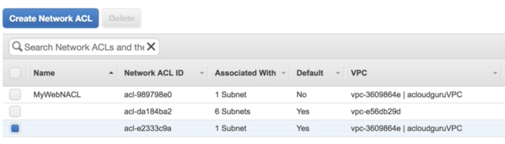

Virtual Private Cloud (VPC) Overview
------------------------------------

Amazon Virtual Private Cloud (Amazon VPC) lets you provision a logically isolated section of the AWS Cloud where you can launch AWS resoruces in a virtual network that you define. you have complete control over your virtual networking environment.

#### Includes

* Selection of your own IP address range
* Creation of subnets
* Configuration of route tables and network gateways

You can easily customize the network configuration for your Amazon Virtual Private Cloud (VPC).

Example: Create a public-facing subnet for your web servers that has access to the Internet, and place your backend systems, such as databases or application servers in a private subnet with no Internet access.

You can leverage multiple layers of security, including security groups and network access control lists, to help control access to Amazon EC2 instances in each subnet.

### Exam Tips

* Security Groups can span subnets
* 1 subnet, 1 Availability Zone (AZ)
* 1 Internet Gateway per VPC
* Internet Gateways are Global

#### Private IP ranges

* 10.0.0.0 - 10.255.255.255 (10/8 prefix)
* 172.16.0/0 - 172.31.255.255 (172.16/12 prefix)
* 192.168.0.0 - 192.168.255.255 (192.168/16 prefix)

[CIDR.xyz](http://cidr.xyz) -- An interactive IP address and CIDR range visualizer

Smallest IP prifix allowed by Amazon is 10/28 prefix (16 IPs)

### Features of a VPC

* Launch instances into a subnet of your choosing
* Assign custom IP address ranges in each subnet
* Configure route tables between subnets
* Create Internet gateway and attach it to your VPC (again 1 Internet Gateway per VPC)
* Much better security control over your AWS resources
* Instance security groups (can span AZs and subnets)
* Subnet network Access Control Lists (ACLs)

### Default VPC vs. Custom VPC

* Default VPC is provisioned by Amazon allowing you to immediately deploy instances
* All subnets in Default VPC have a route to the Internet
* You do not get private subnets in a Default VPC, must be set up
* Each EC2 instance has both a public and private IP address when deployed to a Default VPC
* Instances deployed to a Custom VPC that has a private subnet you only get a private IP address

### VPC Peering

* Allows you to connect one VPC to another via a direct network route using private IP addresses
* Instances behave as if they were on the same private network
* You can peer VPCs with other AWS accounts as well as with other VPCs in the same account
* Peering is in a star configuration (i.e. 1 central VPC peers with 4 others). NO TRANSITIVE PEERING!!!

### More Exam Tips

* Think of a VPC as a logical datacenter in AWS
* Consists of
  * IGWs (i.e. Virtual Private Internet Gateways)
  * Route Tables
  * Network Access Control Lists (ACLs)
  * Subnets
* Security Groups
* 1 Subnet = 1 Availability Zone (AZ)
* Security Groups are Stateful; Network Access Control Lists are Stateless
* NO TRANSITIVE PEERING

VPC Lab Notes
-------------

* Create VPC
  * VPC Name
  * IPv4 CIDR block: 10.0.0.0/16
  * IPv6 CIDR block:
    * No IPv6 Block
    * Amazon provided IPv6 CIDR block (selected)
  * Tenancy:
    * Default (selected)
    * Dedicated [Hardware]
* After creating a VPC
  * Shares subnets with Default VPC (uses same list)
  * Creates a new route table
  * No gateways created (leaves the Default VPC IGW)
  * Creates default network ACL
  * Creates default Security Group
* Create Subnet
  * Name Tag: 10.0.1.0 -
  * VPC: Select new VPC from list
  * VPC CIDRs: Displays based on VPC selected
  * Availability Zone: us-east1a (These are per account. Actual AZs are randomized by Amazon)
  * IPv4 CIDR block: 10.0.1.0/24
  * IPv4 CIDR block:
    * Don't assign an IPv6 CIDR (selected)
    * Specify a custom IPv6 CIDR
* After creating subnet
  * 251 IP addresses available for your use
    * 10.0.0.0 -- Network Address
    * 10.0.0.1 -- Reserved by AWS for the VPC router
    * 10.0.0.2 -- Reserved by AWS for DNS server
    * 10.0.0.3 -- Reserved by AWS for future use
    * 10.0.0.255 -- Network Broadcast Address
* Repeat Create Subnet for 10.0.2.0 -
* Create Internet Gateway
  * Name tag: MyIGW
* Attach Gateway (Detached by default)
  * Can only attach 1 IGW per VPC
* Create Route Table
  * Name tag: MyInternetRouteOut
  * VPC: Select VPC from list
* Update New Route Table
  * Select [Routes] tab and press [Add another route]
    * Destination: 0.0.0.0/0
    * Target: Select your IGW
    * Press [Save]
  * Press [Add another route] to add IPv6
    * Destination: ::/0
    * Target: Select your IGW
    * Press [Save]
  * Select [Subnet Associations] tab
    * Press [Edit]
    * Select Subnet (10.1.1.0 - us-east-1a)
    * Press [Save]
* Update Subnets
  * Select your public subnet (10.0.1.0 - us-east-1a)
  * Select [Subnet Actions] -> [Modify auto-assigned IP settings]
  * Enable auto-assign public IPv4 addresses (checked)
* Launch an EC2 Instance into your new VPC
  * Network: Select your VPC
  * Subnet: Select 10.0.1.0 - us-east-1a
  * Leave rest of details at default
  * Press [Add Storage] and Add Tags
  * Create a new Security Group (Security Groups don't span VPCs)
  * Launch EC2 Instance
* Launch an EC2 Instance into your private Subnet
  * Use defualt Security Group for this one

### Your VPC So Far (Diagram)

### Lab Notes -- Part 2

* Create new Security Group
  * Security group name: My-RDS-SG
  * Description: My-RDS-SG
  * Security group rules [Inbound]
    * See Rules Table below...
* In EC2 assign your new Security Group

#### Rules

| Type         | Protocol | Port Range | Source              |
|--------------|----------|------------|---------------------|
| SSH          | TCP      | 22         | Custom: 10.0.1.0/24 |
| MySQL/Aurora | TCP      | 3306       | Custom: 10.0.1.0/24 |
| HTTP         | TCP      | 80         | Custom: 10.0.1.0/24 |
| HTTPS        | TCP      | 443        | Custom: 10.0.1.0/24 |
| All ICMP -IPv| ICMP     | 0 - 65535  | Custom: 10.0.1.0/24 |

NAT Instances & NAT Gateways
----------------------------

### Lab Notes

#### Creating a NAT Instance

* Select EC2 form AWS management console
* Click [Launch Instance] button
* Select [Community AMIs] in sidebar
* Search for `NAT`
* Find `amzn-ami-vpc-nat-hvm-2014.09.1.x86_64-gp2` and press [Select] button
* Choose a t2.micro Instance Type
* Use defaults except:
  * Network: Select your custom VPC
  * Subnet: Select your public Subnet (10.0.1.0 - us-east-1a)
* [Add Storage] --> [Add Tags]
  * Name: NAT-INSTANCE
* [Configure Security Group]
  * Select an existing security group (radio button)
  * Select `Web-DMZ`
* [Review and Launch]
* Needs HTTPS configured for Security Group
* Select [Instances] from sidebar
* Select your `NAT-INSTANCE` in the table
* [Actions] --> [Networking] --> [Change Source/Dest. Check]
* Disable `Source/Dest. Check` (Note: Do this only for NAT Instances)
* Select your VPC from the AWS management console
* Select [Route Tables] from sidebar
* Select your default Route Table for your VPC
* [Edit] and [Add another route]
  * Destintation: 0.0.0.0/0
  * Target: Select your `NAT-INSTANCE`
  * Press [Save]

#### Creating a NAT Gateway

* Select VPC from AWS management console
* Select [NAT Gateway] from sidebar
* Press [Create NAT Gateway]
  * Subnet: Select your public subnet (10.0.1.0 - us-east-1a)
  * Elastic IP Allocation ID: Press [Create New EIP]
  * Press [Create a NAT Gateway]
  * On the resulting screen there is a [Edit route tables] button, but it takes some time to launch the gateway so don't use it for this lab
  * Press [Close]
* Go back to [NAT Gateways] under VPC Dashboard
* Make sure gateway is available
* Select [Route Tables] from sidebar
* Select your default Route Table in the list
* Select [Routes] tab
* Press [Edit] --> [Add another route]
  * Destination: 0.0.0.0/0
  * Target: Select NAT Gateway (nat-[hash-giberish])
  * Press [Save]

#### Notes

* `NAT Gateway` is used for IPv4 only, `Egress Only Internet Gateway` is used for IPv6.
* Google "Comparison of NAT Instances and NAT Gateways" to find Amazon's summary page on the subject.
* NAT Gateways are preferred over NAT Instances whenever possible.

### Your VPS So Far (Diagram)

### Exam Tips

#### NAT Instances

* When creating a NAT Instance, disable `Source/Destination Check` on the instance
* NAT Instances must be in public subnet
* There must be a route out of the private subnet to the NAT instance in order for this to work
* The amount of traffic that NAT instances can support depends on the instance size. If you are bottlenecking, increase the instance size. (Don't use t2.micro for production for example)
* You can create high availability using Autoscaling Groups, multiple subnets in different AZs, and a script to automate failover.
* Behind a Security Group

#### NAT Gateways

* Preferred by the enterprise
* Scale automatically up to 10Gbps
* No need to patch
* Not associated with Security Groups
* Automatically assigned a public IP address
* Remember to update your Route Tables
* No need to disable Source/Destination Checks

Network Access Control Lists vs. Security Groups
------------------------------------------------

### Lab Notes

* Select VPC from AWS management console
* Select [Network ACLs] from the sidebar
* Select the ACL assocated with your custom VPC
* Press [Create Network ACL]
  * Name tag: MyWebNACL
  * VPC: Select your VPC (Can only be associated with 1 VPC
  * Press [Yes, Cretae]
* Back in [Network ACLs] select `MyWebNACL` in the list
* Select [Inbound Rules] tab
* Press [Edit]
* Press [Add another rule]
  * Fill out the Inbound rules according to table below
  * Fill out the Outbound rules according to table below

### Inbound Rules

| Rule # | Type            | Protocol | Port Range | Source    | Allow/Deny |
|--------|-----------------|----------|------------|-----------|------------|
| 100    | HTTP (80)       | TCP (6)  | 80         | 0.0.0.0/0 | ALLOW      |
| 200    | HTTPS (443)     | TCP (6)  | 443        | 0.0.0.0/0 | ALLOW      |
| 300    | SSH (22)        | TCP (6)  | 22         | 0.0.0.0/0 | ALLOW      |
| *      | ALL Traffic     | ALL      | ALL        | ::/0      | DENY       |
| *      | ALL Traffic     | ALL      | ALL        | 0.0.0.0/0 | DENY       |

### Outbound Rules

| Rule # | Type            | Protocol | Port Range | Source    | Allow/Deny |
|--------|-----------------|----------|------------|-----------|------------|
| 100    | HTTP (80)       | TCP (6)  | 80         | 0.0.0.0/0 | ALLOW      |
| 200    | HTTPS (443)     | TCP (6)  | 443        | 0.0.0.0/0 | ALLOW      |
| 300    | Custom TPC Rule | TCP (6)  | 1024-65535 | 0.0.0.0/0 | ALLOW      |
| *      | ALL Traffic     | ALL      | ALL        | ::/0      | DENY       |
| *      | ALL Traffic     | ALL      | ALL        | 0.0.0.0/0 | DENY       |

### Testing Out the Rules

* Install and configure a web server and create a basic HTML page and make sure it works
* Add a new rule matching Rule # 100 (HTTP) as Rule # 101
* Try to access your web page...it should still work fine
* Change Rule # 101 to Rule # 99
* Access to your web page should be blocked
* Remove the test Rule # 99

### Exam Tips

* Subnets can be associated with only 1 ACL
* By default creating a private ACL all Inbound/Outbound traffic is set to `DENY`
* For IPv4 start with Rule # 100 and incrment by 100
* [Ephemeral Ports](https://docs.aws.amazon.com/AmazonVPC/latest/UserGuide/VPC_ACLs.html#VPC_ACLs_Ephemeral_Ports). We used 1024-65535 for this lab
* ACLs are evaluated before Security Groups

### More Exam Tips

* VCP have an ACL by default, configured to allow all inbound and outbound traffic.
* Custom ACLs deny all inbound and outbound traffic. Add rules to allow traffic.
* Each subnet must be associated with a Network ACL. Will default to the default ACL if not explicitly associated with an ACL.
* Multiple subnets can be associaed with 1 Network ACL.
* Subnets can be associated with only 1 Network ACL, Associating a subnet to an ACL removes any previous association.
* Network ACL rules are evaluated in ascending numberical order.
* Network ACLs have separate Inbound and Outbound rules either can allow or deny traffic
* Network ACLs are stateless; responses to allowed inbound traffic are subject to the rules for outbound traffic (and vice versa). Remember Security Groups are Stateful.

Custom VPCs and ELBs
--------------------

* Select EC2 from AWS management console
* Select [Load Balancers] from the sidbar
* Three types of Load Balancers
  * Application Load Balancer
  * Network Load Balancer
  * Classic Load Balancer (Previous Generation)
* Create a new Applicaiton Load Balancer
  * Name: `MyALB`
  * Scheme:
    * internet-facing (selected)
    * internal
  * IP address tyupe:
    * ipv4 (selected)
    * dualstack
  * Listeners
    * Load Balanceer Protocol: HTTP
    * Load Balancer Port: 80
  * Avilability Zones:
    * Select: us-east-1a (must be an internet facing subnet
    * Press [Next: Configure Security Settings]
      * ERROR: At least two subnets must be specified
      * TIP: When setting up your VPC and plan to use a Load Balancer remember to configure subnets in at lease two different Availability Zones (AZ)

VCP Flow Logs
-------------

* Capture information about the IP traffic flowing through network interfaces in your VPC
* Flow log data is stored using Amazon CloudWatch logs
* View flow log data in Amazon CloudWatch logs

Flow logs can be created at 3 levels:

* VPC
* Subnet
* Network Interface Level

### Lab Notes

* Select VPC from AWS management console
* Select [Your VPCs] from sidebar
* Select your VPC from the list
* Select [Actions] --> [Create Flow Log]
  * Resources: {displays your vpc]}
  * Filter: 
    * All (selected)
    * Accept
    * Reject
  * Role: {Create a new Role}
    * Click [Set Up Permissions] link
      * IAM Role: Create a new IAM Role (selected)
      * Role Name: flowlogsRole
      * Press [Allow]
    * Select flowlogsRole from the list
  * ARN: {display only}
  * Destination Log Group: 
    * Create a new Log Group over in CloudWatch
    * Select your new Log Group
* Press [Create Flow Log]

### Exam Tips

* Cannot enable flow logs for VPCs that are peered with your VPC unless the peer VPC is in your account
* You cannot tag a flow log
* After creation of a flow log its cofiguration can't be changed. For example, you can't associate a different IAM role
* Not all IP Traffic is monitored
  * Traffic generated by instance when they contact the Amazon DNS, if you use your own DNS that traffic is logged.
  * Traffic generated by a Widows instance for Amazon Windows license activation.
  * Traffic to ad from 169.254.169.254 for instance metadata.
  * DHCP traffic
  * Traffic to the reseved IP for the default VPC router.

NAT vs. Bastion
--------------

### Network Diagram

### NAT

Allows instances in private subnets access out to the Internet, but does not allow access to instances inside the private subnet from the Internet, such as SSH connections.

### Bastion (A.K.A. Jumpbox)

Used to allow access to instances inside private subnets from the public Internet for adminstrative purposes, such as SSH connections.

### Exam Tips

* NAT is used to provide Internet traffic to EC2 instances in private subnets.
* Bastion is used to securely administer EC2 instances (using SSH or RDP) in private subnets. Also, sometimes called jump boxes.

VPC Endpoints
-------------

Endpoints are used to provide internal gateway access to AWS servers outside our VPC without requiring public Internet access to those services (e.g. S3 buckets).

### Lab Notes

* Select IAM from AWS management console
* Press [Create Role]
  * Select EC2 from the list
  * Select EC2: Allows EC2 instances to call AWS services on your behalf.
  * Press [Next: Permissions]
* Search for s3
  * Select AmazonS3FullAccess from the list
  * Press [Next: Review]
    * Role name: `S3Admin`
    * Press [Create role]
* Select EC2 from AWS management console
* Select [Instances] from the sidebar
* Select your instance (`MyMySQL` for this lab exercise)
* Select [Actions] -> [Instance Settings] -> [Attach/Replace IAM Role]
  * IAM role: `S3Admin`
  * Press [Apply]
* Select VPC from AWS management console
* Select [Network ACLs] from sidebar
* Select your default Network ACL from the list (see table below)
* Select [Subnet Associations] tab
  * Associate your public subnet 10.0.1.0 - us-east-1a
  * Press [Save]

#### Network ACLs

#### Testing public access to S3

* SSH into instance `ssh ec2-user@10.0.2.143 -i mypvk.pem`
* `sudo su`
* `aws s3 ls`
* Shows list of buckets over Internet access
* Select VPC from AWS management console
* Select [Route Tables] from the sidbar
* Select our default route table from the list
* Remove route to NAT gateway (This will effectively shutddown Internet access)
* `aws s3 ls` -- Should no longer show list

### Create Endpoint Lab Notes

* Select VPC from AWS management dashboard
* Select [Endpoints] from the sidebar
* Press [Create Endpoint]
* Select com.amazonaws.us-east-1.s3 | Owner: amazon | Type: Gateway from the list
* Select your VPC from the dropdown list
* Select the `Main` route table from the list (subnet-d666a78b | 10.0.2.0 - us-east-1b
* Policy: `Full Access`
* Press [Create endpoint]
* Back in Terminal: `aws s3 ls` -- Should again show the list of buckets

### VPC Summary

#### Final VPC Diagram

### Exam Tips

#### NAT Instances

* Disable `Source/Destination Check` on the instance.
* Must be in a public subnet.
* There must be a route out of the private subnet to the NAT instance.
* The amount of traffic the NAT instance can support depends on the instance size. If bottlenecking, increase the instance size.
* You can create high availability using Autoscaling Groups, multiple subnets in different AZs, and a script to automate failover.
* Behind a Security Group.

#### NAT Gateways

* Preferred by the enterprise
* Scale up automatically up to 10Gbps
* No need to patch
* Not associated with Security Groups
* Automatically assigned a public IP address
* Remember to update your route tables
* No need to disable `Source/Destination Check`
* More secure than a NAT instance

#### Network ACLs

* Your VPC automatially comes with a default network ACL, and by default it allows all outbound and inbound traffic.
* You can create custom network ACLs. By default, each custom network ACL denies all inbound and outbound traffic until you add rules.
* Each subnet in your VPC must be associated with a network ACL. If you don't explicitly associate a subnet, the subnet is associated with the default ACL.
* You can associate an ACL with multiple subnets; however, a subnet can be associated with only one ACL at a time. When associating a subnet with an ACL the existing association is removed.
* Network ACLs contain a numbered list of rules. Rules are evaluated in ascending numerical order.
* Network ACLs have separate inbound and outbound rules, each rule can either allow or deny traffic.
* Network ACLs are stateless; responses to allowed inbound traffic are subject to the rules for outbound traffic (and vice versa).
* Block IP addresses using network ACLs not Security Groups.

#### Application Load Balancers (ALBs)

* You will need at least 2 public subnets in order to deploy an ALB.

#### VPC Flow Logs

* You cannot enable flow logs for VPCs that are peered with your VPC unless the peer VPC is in your account.
* You cannot tag a flow log.
* After you've created a flow log, you cannot change its configuration; for example you cannot associate a different AIM role with the flow log.
* Not all IP Traffic is monitored:
  * Traffic generated by instances when they contact the Amazon DNS server. If you use your own DNS it is logged.
  * Traffic generated by a Windows instance for Amazon Windows license activation.
  * Traffic to and from 169.254.169.254 for instance metadata.
  * DHCP traffic.
  * Traffic to the reserved IP address for the default VPC router.

#### VPC Endpoints

* Endpoint types can be Gateway or Interface.